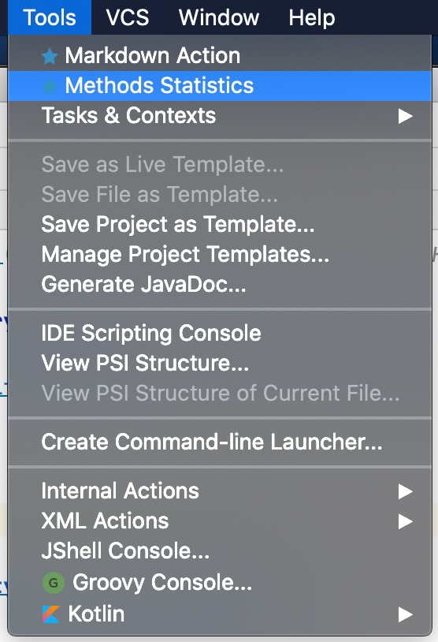
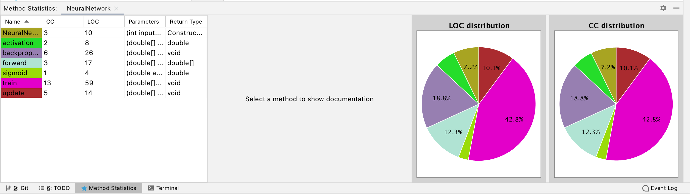
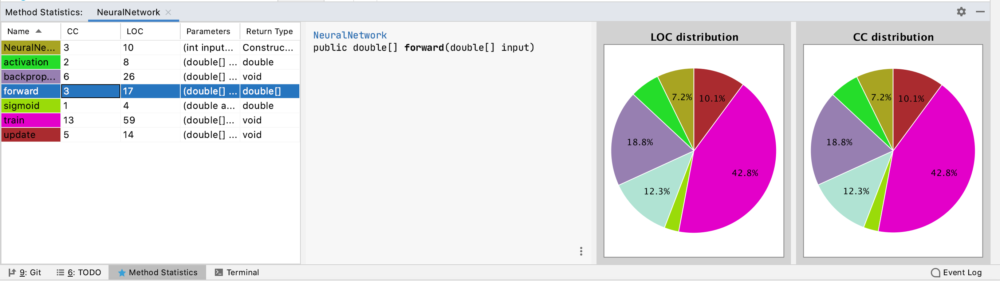
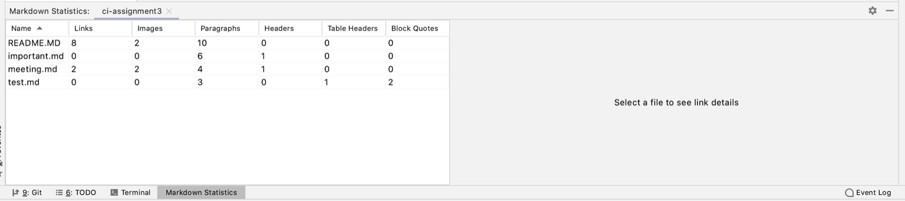
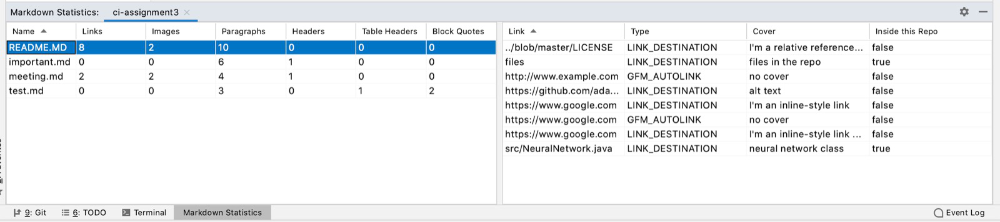

Method and Markdown Statistics Plugin
=====================================

As the name suggests, this is an IntelliJ plugin for analyzing your methods and markdown files.

How to build
-------------
You can simply download or clone the project and run `gradle runIde` using IntelliJ IDEA. A new IDE will open up where you can follow the steps below.

Features
---------
Both implemented features can be found in the Tools menu bar:

### Method statistics plugin

For the method summary we measure the Cyclomatic Complexity(CC) and the Lines of Code(LOC) metrics and show their distribution over a class. Clicking on a method in the table above will show its summary.

Double clicking on a method will reposition the mouse cursor on the respective method in the opened class.

### Markdown statistics plugin

For our markdown feature we display basic features like number of links and paragraphs as seen in the example:

Clicking on one of the files gives a summary of the links, including if the linked file is inside the repo:

Note that double clicking of one of those links repositions your cursor on the respective link.
